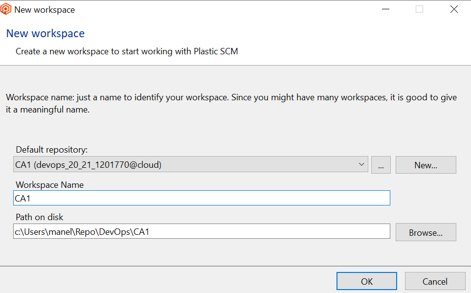

**git Alternatives**

**Plastic SCM Steps**

1.1 Setup and install Plastic SCM;

1.2 Plastic for developers option was chosen - Plastic SCM provides a simpler GUI for artists and a more comprehensive GUI for developers;

1.3 The option for a centralized mode was chosen - to provide a different experience than GIT;

1.4 A repository was created with name "CA1" with server devops_21_21_1201770@cloud;

1.5 A workspace was created with name "CA1";

1.6 The tut-basic folder was copied to the folder created in the designated path;
___

2.1 To convert the currently private objects(files) to source-controlled items:

- Move to the "Workspace Explorer" area;
- Right-click the root workspace folder - Select "Add directory tree to source control", this is similar to the "git add " command;

  
- Right-click the root workspace folder - Select "Checkin" and with all objects selected click the "Checkin" button, this is similar to the "git commit" command;

___
3.1 Create a new Label:

- Head to Branch Explorer;

- Right-click the initial checkin we've just made and select "Label this changeset...";

- Fill in the name Name and Comments sections;

- The Branch Explorer view now looks like this:

___
4.1 Creating the new branch for email feature:

- Right-click current changeset and select "Create branch from this changeset...":

- Input the name and any comments for the new branch:

- The Branch Explorer view now shows the new branch:

4.2 Make changes to implementation;

4.3 In the Workspace Explorer view right-click the new Test folder and select "Add to source control":

4.4 Checkin the changes in the new branch:

- In the Pending Changes view review the differences between the previous file state and the current, if needed, by clicking "Show diff":

- Checkin the changes by clicking "Checkin":

___
5.1 Switch to main changeset (currently v1.2.0):

5.2 Merge branch into main changeset (currently v1.2.0) by rich-clicking the email-field branch and selecting "Merge from this changeset"

- Click "Apply Changes":

- Checkin the changes to the changeset by clicking "Checkin" in the "Pending changes" view:

5.3 Add label to main:

- In the "Branch explorer" view, right-click the most recent changeset and select "Label this changeset":

___
6.1 Create new branch called "fix-invalid-email" by right-clicking the v1.3.0 changeset and selecting "Create branch from this changeset":

6.2 Input branch name and appropriate comments;

___
7.1 Switch to main changeset (currently v1.3.0):

7.2 Merge branch into main changeset (currently v1.3.0) by rich-clicking the fix-invalid-email branch and selecting "Merge from this changeset"

- Click "Apply Changes":

- Checkin the changes to the changeset by clicking "Checkin" in the "Pending changes" view:

7.3 Add label to main:

- In the "Branch explorer" view, right-click the most recent changeset and select "Label this changeset":

8.1 Add README info and label "ca1" signifying end of assignement:
- In the "Pending changes" view, click the "Checkin" button;

- In the "Branch explorer" view, right-click the most recent changeset and select "Label this changeset":

___